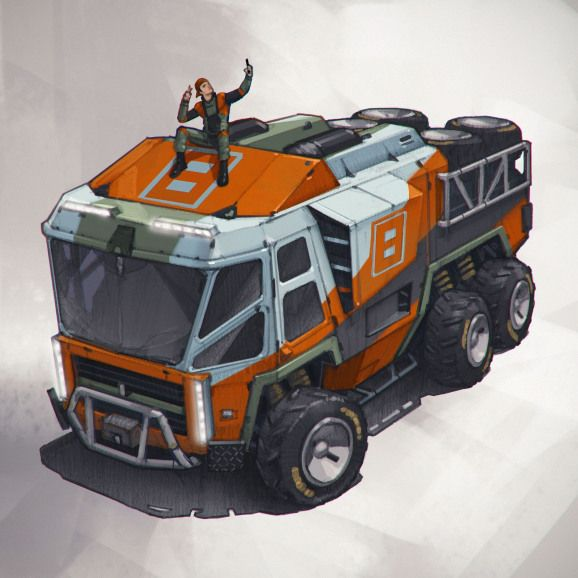

Based on the EotI Rambler mated with a truck

|Silhouette|Max Speed|Handling|Armor|Defense|HT Threshold|SS Threshold|
|:--------:|:-------:|:------:|:---:|:-----:|:----------:|:----------:|
|       3  |   3     |   -1   | 1   | 0     |     10     |     10     |

- **Control Skill:** [Driving](https://genesysref.netlify.app/skill/driving_crb).
- **Complement:** 1 driver, 1 gunner
- **Passenger Capacity:** 4.
- **Consumables:** 7 days.
- **Encumbrance Capacity:** 75.
- **Price/Rarity:** 17,000/5.

Abilities:

- **All-Terrain:** When making a [Driving](https://genesysref.netlify.app/skill/driving_crb) check to direct the vehicle, your character may remove  ■■ added to the check due to terrain.

Weapons:

| Name | Firing Arc | Skill | Damage | Critical | Range | Qualities  |
| ---- | ---------- | ----- | ------ | -------- | ----- | ------------------------------- |
 1 turret-mounted assault cannon | All | [Gunnery](https://genesysref.netlify.app/skill/gunnery_crb) | 1   | 4   | Long | [Auto-fire](https://genesysref.netlify.app/quality/auto-fire_crb) |  

ee
